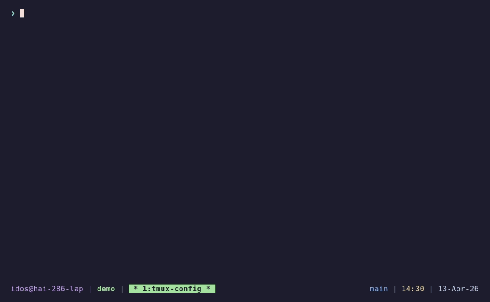

# tmux-config

My personal tmux configuration — Catppuccin Mocha theme, vim-style navigation, mouse support, and sane defaults.



## Install

```sh
git clone --recursive https://github.com/IdoSagiv/tmux-config.git ~/tmux-config
cd ~/tmux-config
./install.sh
```

The installer symlinks config files into place and installs plugins via TPM.
Any existing `~/.tmux.conf` is backed up to `~/.tmux.conf.bak.<timestamp>`.

To remove:

```sh
./install.sh --uninstall
```

### Dependencies

- tmux 3.2+
- git
- xclip (for clipboard integration on X11)

## The 30-second tour

**Prefix:** `Ctrl+b` (default).

### Navigation

| What | Keys |
|---|---|
| Move between panes | `Alt+h/j/k/l` (no prefix) |
| Jump to window | `Alt+1..9` (no prefix) |
| Session tree picker | `prefix s` |
| Toggle last session | `prefix S` |

### Splitting & Windows

| What | Keys |
|---|---|
| Split vertical | `prefix \|` |
| Split horizontal | `prefix -` |
| New window (cwd) | `prefix c` |
| Swap windows left/right | `prefix <` / `prefix >` |

### Panes

| What | Keys |
|---|---|
| Resize panes | `prefix H/J/K/L` (repeatable) |
| Swap panes | `prefix Shift+Arrow` |
| Kill pane | `prefix x` |
| Sync panes (broadcast) | `prefix e` |

### Copy/paste — vim-style

| What | Keys |
|---|---|
| Enter copy mode | `prefix [` |
| Begin selection | `v` |
| Rectangle select | `Ctrl+v` |
| Yank to clipboard | `y` |
| Cancel | `Escape` |
| Paste from buffer | `prefix P` |
| Start of line | `Home` |
| End of line | `End` |

### Mouse

- **Click** a pane to focus it
- **Scroll** to enter copy mode (inside vim, scroll sends `Ctrl+y`/`Ctrl+e` instead)
- **Drag** to select text — copies to clipboard, highlight stays
- **Double-click** selects word, **triple-click** selects line
- **Middle-click** pastes from X primary selection
- **Shift+Right-click** opens the terminal's native context menu
- `Ctrl+Shift+C` copies selected text to clipboard (works in copy mode and inside vim)

### Utility

| What | Keys |
|---|---|
| Reload config | `prefix r` |
| Clear screen + scrollback | `prefix Ctrl+l` |

## Features

- **Catppuccin Mocha** color scheme — status bar, pane borders, window tabs
- **Status bar** shows user@host (or remote SSH host), session name, git branch, time, and date
- **Vim-style** keybindings throughout (hjkl navigation, vi copy mode)
- **Mouse support** with intelligent vim detection for scrolling
- **Normal terminal mouse behavior** — selection stays highlighted, middle-click paste, Ctrl+Shift+C all work as expected
- **256-color / true color** terminal support
- **Automatic window rename** based on current directory
- **Windows start at 1**, auto-renumber on close
- **Pane dimming** — inactive panes are visually dimmed
- **Splits inherit current directory** — new panes and windows open where you are
- **Fast escape time** (10ms) — no delay for vim users
- **TPM plugins** — tmux-yank for clipboard integration

## Files

| File | Purpose |
|---|---|
| `tmux.conf` | Main config → symlinked to `~/.tmux.conf` |
| `scripts/user_host.sh` | Status bar script → symlinked to `~/.tmux/scripts/` |
| `plugins/tpm/` | Tmux Plugin Manager (git submodule) |
| `install.sh` | Installer / uninstaller |
| `demo.tape` | VHS script — run `vhs demo.tape` to regenerate `demo.gif` |

## Customizing

Edit `tmux.conf` in the repo and press `prefix r` inside tmux. The installer
symlinks the file, so repo edits take effect immediately.
